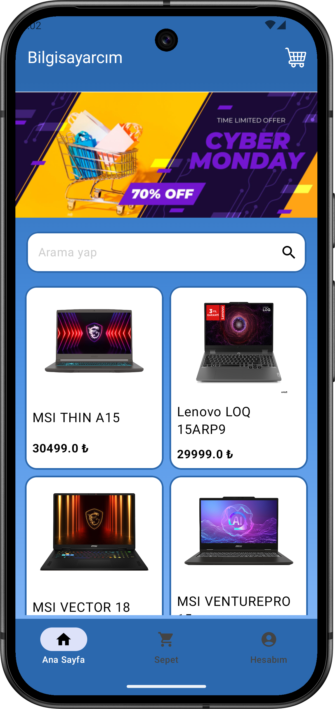
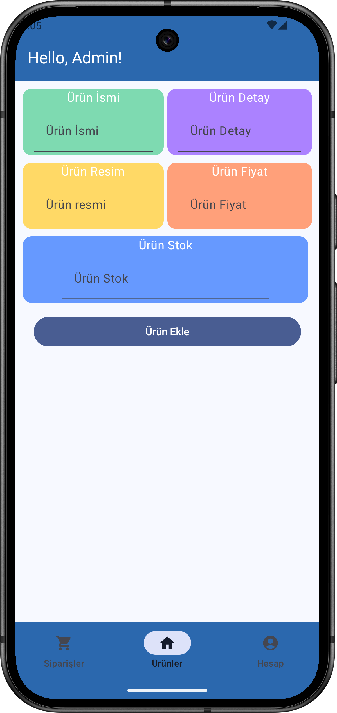
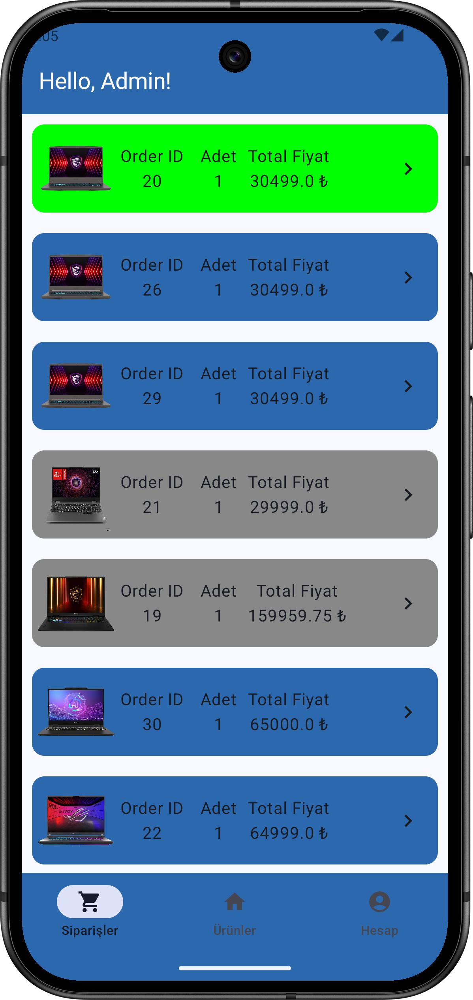
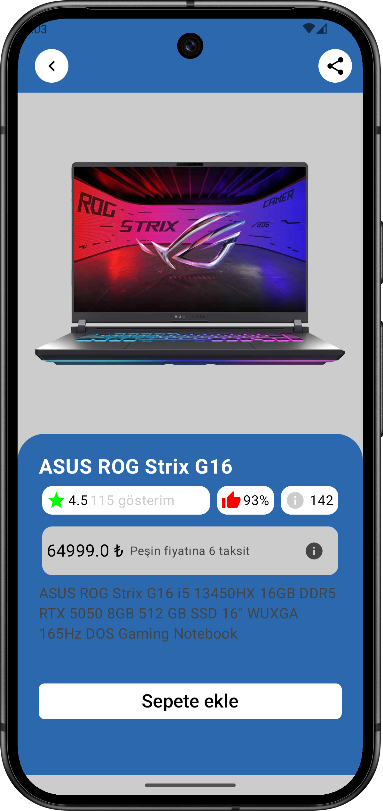
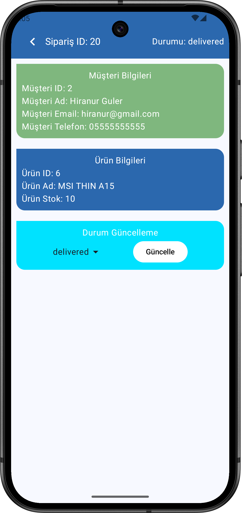
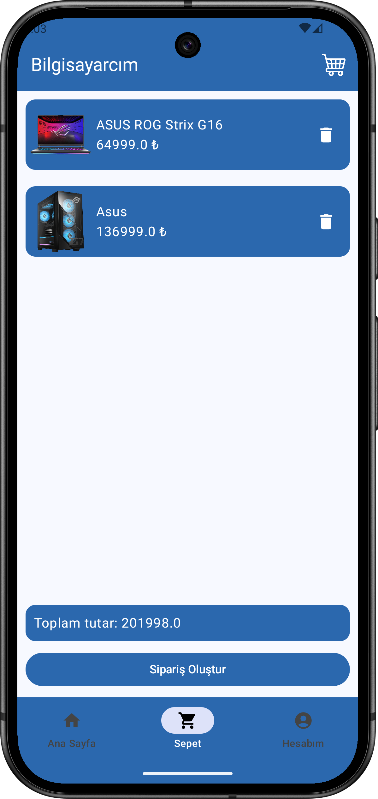
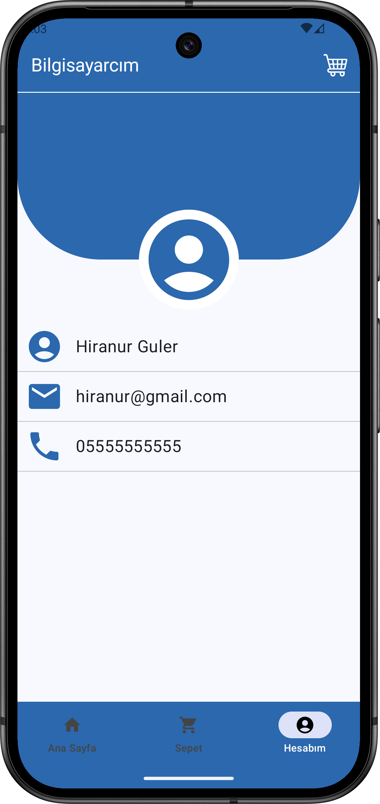

# 📦 E-Ticaret Mobil Uygulaması

Bu proje, **kendimi backend alanında geliştirmek** için yaptığım bir e-ticaret mobil uygulamasıdır.  
Frontend kısmı mobil uygulama olarak geliştirilmiş, backend ise **PHP + MySQL** kullanılarak yazılmıştır.  

Kullanıcı tarafında ürün görüntüleme, sepete ekleme ve sipariş verme işlemleri yapılabilirken;  
Admin tarafında ürün yönetimi, sipariş görüntüleme/düzenleme ve durum güncellemeleri yapılabilmektedir.  

---

## 🚀 Özellikler

### 👤 Kullanıcı
- Ürünleri listeleme ve detay sayfasını görüntüleme
- Ürünleri sepete ekleme
- Sipariş oluşturma ve takip etme

### 🛠️ Admin
- Yeni ürün ekleme
- Siparişleri görüntüleme ve düzenleme
- Sipariş durumlarını güncelleme

---

## 🖥️ Backend (PHP + MySQL)
- Backend dili: **PHP**
- Veritabanı: **MySQL (phpMyAdmin - Hostinger Localhost)**
- Admin ve kullanıcı için ayrı endpointler
- Temel CRUD işlemleri (Create, Read, Update, Delete)
- Sipariş yönetim sistemi

---

## 📱 Ekran Görüntüleri

| Ana Sayfa | Ürün Ekle | Admin Siparişler |
|-----------|-----------|-----------------|
|  |  |  |

| Ürün Detayı | Sipariş Detayı | Sepet | Kullanıcı Sayfası |
|-------------|----------------|-------|-------------------|
|  |  |  |  |

---

## ⚙️ Kurulum

### Mobil Uygulama
1. Projeyi klonla:  
   ```bash
   https://github.com/sametguler81/EcommerceApp.git
